# DSA 3050A – Business Intelligence & Visualization

## Mid-Semester Practical Examination

## Student Information


| Field            | Details              |
| ---------------- | -------------------- |
| **Student Name** | BOPHINE ARNOLD ODIYO |
| **Student ID**   | 668821               |

## Dataset Information


| Field                      | Details                                                                |
| -------------------------- | ---------------------------------------------------------------------- |
| **Dataset Name**           | Global Superstore Sales Dataset                                        |
| **Source URL**             | https://www.kaggle.com/datasets/apoorvaappz/global-super-store-dataset |
| **Original Rows**          | 51,290 rows                                                            |
| **Original Columns**       | 24 columns                                                             |
| **Columns After Cleaning** | 23 columns                                                             |
| (Postal Code removed)      |                                                                        |
| **Date Range**             | January 2011 – September 2014                                         |
| **Markets Covered**        | 7 (United States, EU, APAC, LATAM, Africa, EMEA, Canada)               |

## Business Problem

**Organization:** Global Superstore — an international retail company operating across 7 global markets.

**Problem Statement:**
Management requires a comprehensive Business Intelligence dashboard to analyze global sales performance, profitability across regions and product categories, customer segment behaviour, and shipping efficiency. The raw dataset contained missing postal codes, inconsistent values, incorrect data types, and unstructured fields that required cleaning and transformation before meaningful analysis could be performed.

**Business Goals:**

- Track total sales, profit, and order volumes across 4 years (2011–2014)
- Identify which markets, categories, and customer segments drive the most revenue and profit
- Understand shipping mode usage and order priority distribution
- Enable dynamic, interactive filtering for regional and categorical decision-making

## Question 1: Power Query Data Preparation

### A. Basic Data Cleaning

#### Task 1 — Renaming Unclear Columns

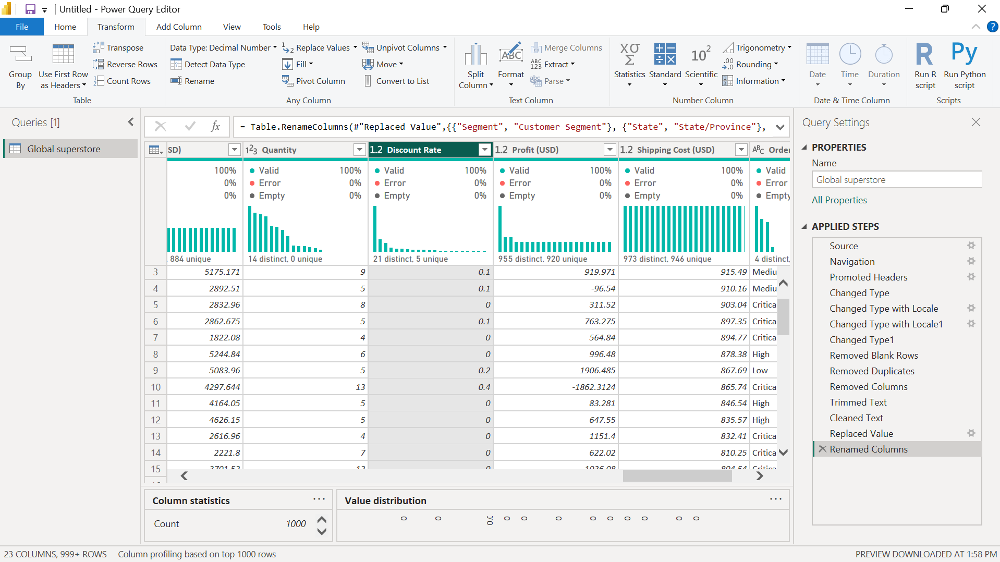

The following columns were renamed to improve clarity and readability:

| Original Name | Renamed To |
| Segment | Customer Segment |
| State | State/Province |
| Sales | Sales (USD) |
| Profit | Profit (USD) |
| Shipping Cost | Shipping Cost (USD) |
| Discount | Discount Rate |

**How it was done:** Double-clicked each column header in Power Query Editor and typed the new name. The step appears in Applied Steps as **"Renamed Columns"**.

#### Task 2 — Changing Data Types

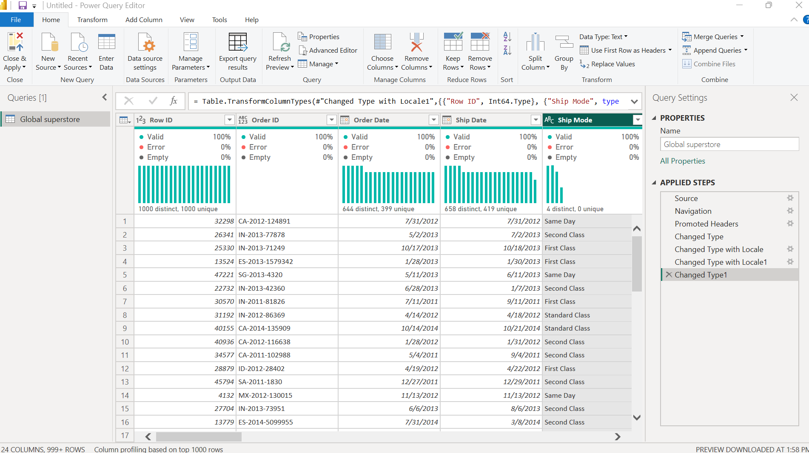

Data types were set correctly for all 23 columns:

| Column | Data Type Set |
| Row ID | Whole Number |
| Order Date | Date |
| Ship Date | Date |
| Sales (USD) | Decimal Number |
| Profit (USD) | Decimal Number |
| Shipping Cost (USD) | Decimal Number |
| Discount Rate | Decimal Number |
| Quantity | Whole Number |
| All text columns | Text |

**How it was done:** Clicked the data type icon on the left of each column header and selected the appropriate type. Steps appear as **"Changed Type"**, **"Changed Type with Locale"**, and **"Changed Type1"** in Applied Steps.

#### Task 3 — Removing Duplicate Records

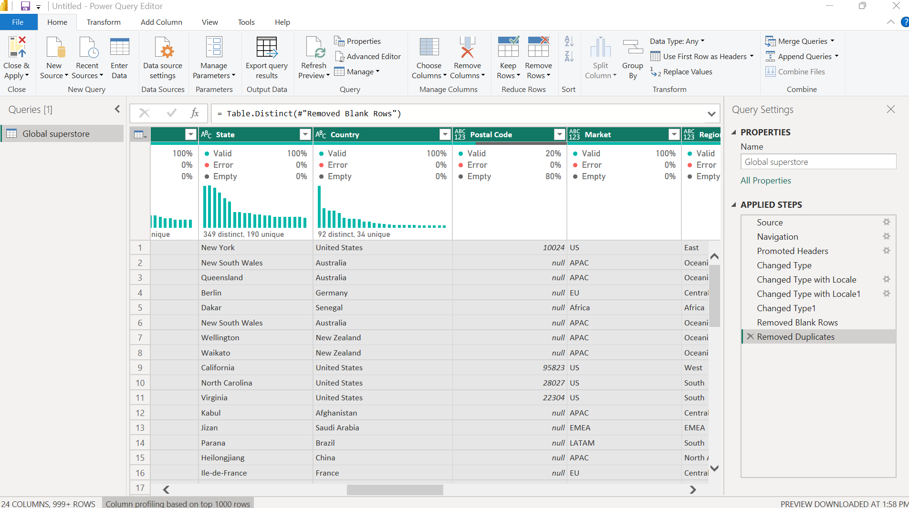

All columns were selected (Ctrl+A) and duplicates were removed using Home → Remove Rows → Remove Duplicates. The dataset contained 0 exact duplicate records; the step is confirmed in Applied Steps as **"Removed Duplicates"**.

#### Task 4 — Removing Blank Rows

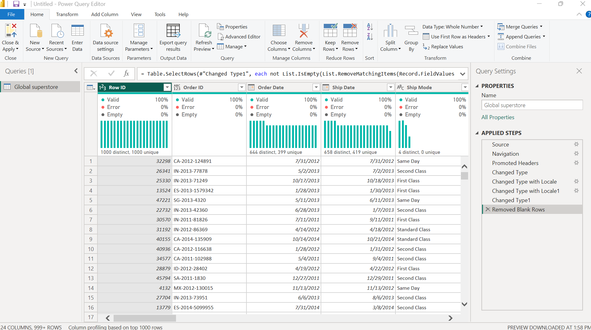

Blank rows were removed using Home → Remove Rows → Remove Blank Rows. This ensures no fully empty records exist in the cleaned dataset. The step appears in Applied Steps as **"Removed Blank Rows"**.

#### Task 5 — Trim and Clean Text Columns

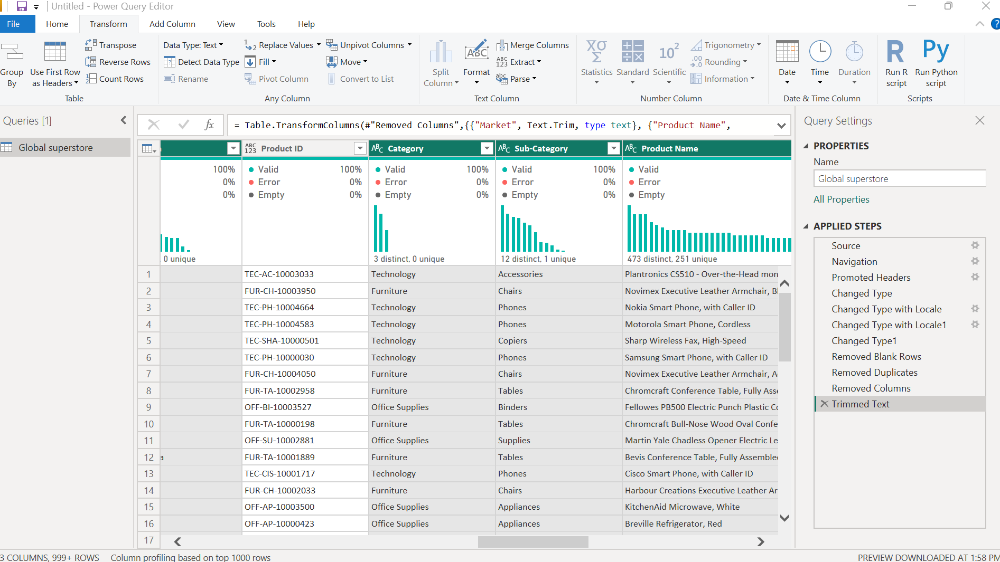
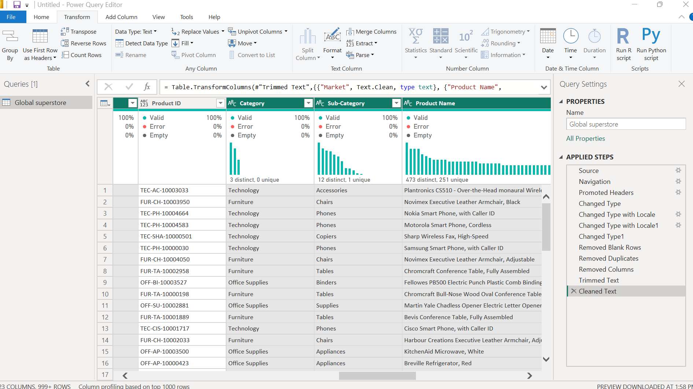

The following text columns were trimmed and cleaned to remove leading/trailing spaces and non-printable characters:

- Customer Name, Product Name, City, State/Province, Country, Region, Market, Ship Mode, Customer Segment, Category, Sub-Category, Order Priority

**How it was done:** Selected all text columns using Ctrl+Click → Transform tab → Format → Trim, then Format → Clean. Steps appear as **"Trimmed Text"** and **"Cleaned Text"** in Applied Steps.

#### Task 6 — Replacing Inconsistent Values

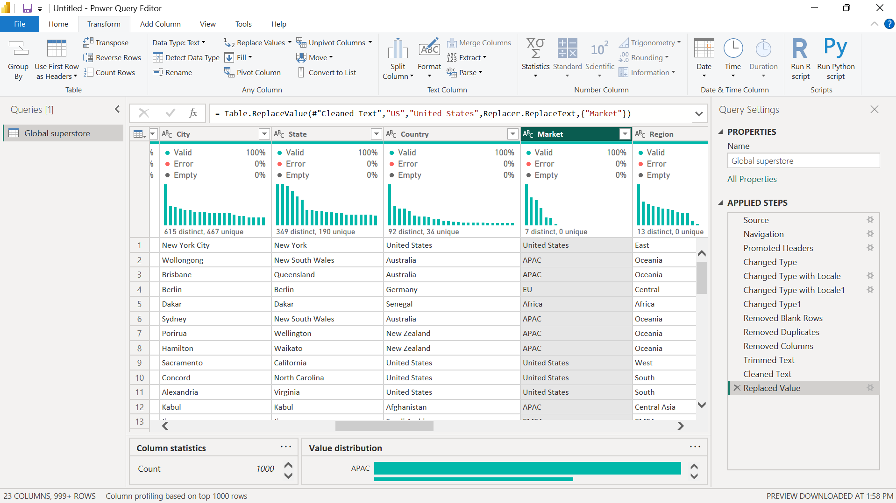

The **Market** column contained the value "US" which was inconsistent with the full country names used elsewhere. This was replaced:


| Column | Find | Replace With  |
| ------ | ---- | ------------- |
| Market | US   | United States |

**How it was done:** Clicked the Market column → Transform → Replace Values → entered "US" and "United States". Step appears as **"Replaced Value"** in Applied Steps.

#### Task 7 — Removing Unnecessary Columns


The **Postal Code** column was removed because 41,296 of 51,290 values (80.5%) were null, making the column analytically useless for business intelligence purposes.

**How it was done:** Right-clicked the Postal Code column header → Remove. Step appears as **"Removed Columns"** in Applied Steps.

### B. Intermediate Transformations

#### Task 8 — Spliting One Column into Multiple Columns


The **Product ID** column (e.g., "FUR-BO-10001798") was split by the "-" delimiter into three separate columns:

- Product Category Code (e.g., "FUR")
- Product Sub-Code (e.g., "BO")
- Product Number (e.g., "10001798")

**How it was done:** Selected the Product ID column → Transform → Split Column → By Delimiter → Custom "-" → Each occurrence of the delimiter.

#### Task 9 — Merging Two or More Columns


The **City** and **Country** columns were merged into a new column named **"City, Country"** using a comma-space separator (e.g., "New York, United States"). This column is used in the Map visual tooltip.

**How it was done:** Ctrl+Click City and Country → Add Column → Merge Columns → Custom separator ", ".

#### Task 10 — Creating a Custom Column


A custom column named **"Net Revenue (USD)"** was created using the formula:

```
[Sales (USD)] - [Shipping Cost (USD)]
```

This column shows the revenue remaining after logistics costs are deducted, providing a cleaner profitability indicator.

**How it was done:** Add Column → Custom Column → entered the formula above.

#### Task 11 — Creating a Conditional Column


A conditional column named **"Profit Status"** was created with the following logic:


| Condition        | Output       |
| ---------------- | ------------ |
| Profit (USD) > 0 | "Profitable" |
| Profit (USD) = 0 | "Break-Even" |
| Profit (USD) < 0 | "Loss"       |

**How it was done:** Add Column → Conditional Column → configured the three rules above.

#### Task 12 — Extracting Year, Month, Quarter, and Day from a Date Column

.png>)

Five new columns were extracted from the **Order Date** column:


| New Column         | Method                                | Example Value |
| ------------------ | ------------------------------------- | ------------- |
| Order Year         | Add Column → Date → Year            | 2013          |
| Order Month Number | Add Column → Date → Month           | 11            |
| Order Month Name   | Add Column → Date → Name of Month   | November      |
| Order Quarter      | Add Column → Date → Quarter of Year | 4             |
| Order Day          | Add Column → Date → Day             | 17            |

Each column was renamed immediately after creation for clarity.

#### Task 13 — Filtering Rows Using at Least Two Conditions

.png>)

Rows were filtered using two conditions to remove zero-value anomaly records:

- **Condition 1:** Sales (USD) > 0
- **Condition 2:** Quantity > 0

**How it was done:** Clicked the dropdown on Sales (USD) → Number Filters → Greater Than → 0, then repeated for Quantity. Steps appear as **"Filtered Rows"** and **"Filtered Rows1"** in Applied Steps.

#### Task 14 — Sorting Data Meaningfully

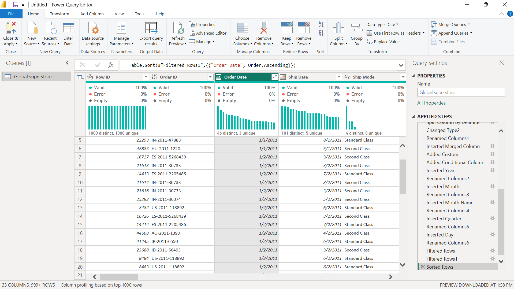

The dataset was sorted by **Order Date** in ascending order (oldest to newest — from January 2011 to September 2014) to establish chronological order for trend analysis.

**How it was done:** Clicked the Order Date column → Home → Sort Ascending. Step appears as **"Sorted Rows"** in Applied Steps.

#### Task 15 — Adding an Index Column

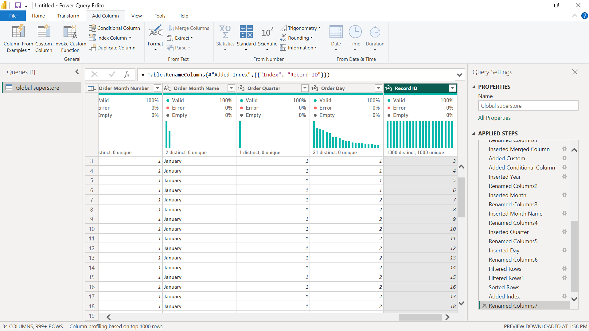

An Index column starting from 1 was added and renamed **"Record ID"** to uniquely identify each cleaned row in the dataset.

**How it was done:** Add Column → Index Column → From 1 → renamed to "Record ID". Step appears as **"Added Index"** in Applied Steps.

### C. Advanced Power Query Tasks

#### Advanced Task 1 — Group By with Multiple Aggregations

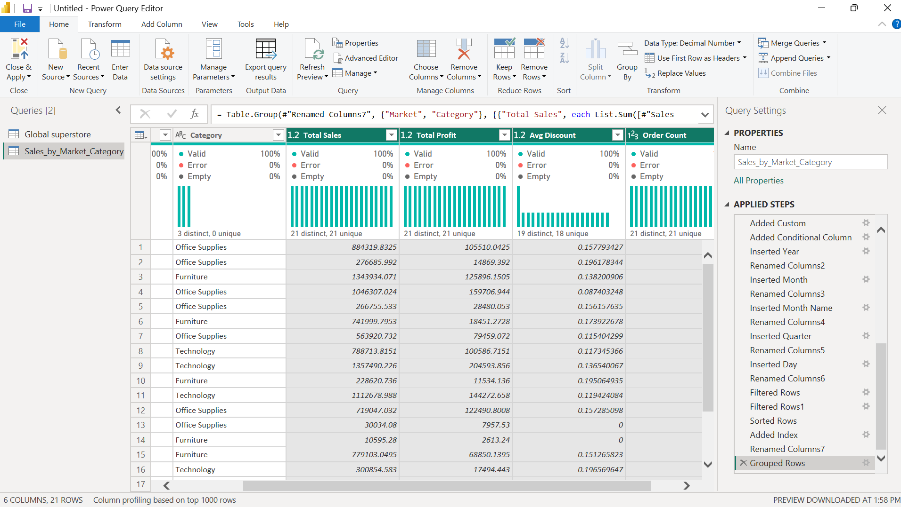

A duplicate of the main query was created and named **"Sales_by_Market_Category"**. This query groups data by Market and Category and computes:


| Aggregation  | Field                    |
| ------------ | ------------------------ |
| Total Sales  | Sum of Sales (USD)       |
| Total Profit | Sum of Profit (USD)      |
| Avg Discount | Average of Discount Rate |
| Order Count  | Count of Rows            |

**Result:** 21 rows showing sales and profit performance by market-category combination.

**How it was done:** Right-clicked main query → Duplicate → renamed → Home → Group By → Advanced → configured 4 aggregations. Step appears as **"Grouped Rows"** in the Sales_by_Market_Category query Applied Steps.

#### Advanced Task 2 — Creating a Date Table

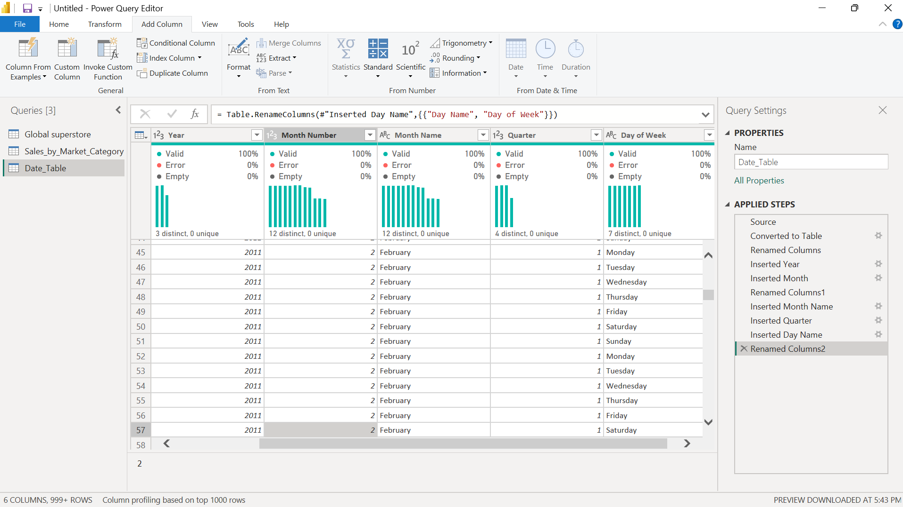

A separate **Date_Table** query was created from scratch using a blank query. It covers the full date range of the dataset (1 January 2011 to 31 December 2014 — 1,461 days).

Columns generated:

- Date, Year, Month Number, Month Name, Quarter, Day of Week

**M Formula used:**

```
= List.Dates(#date(2011,1,1), 1461, #duration(1,0,0,0))
```

The list was converted to a table and all date columns were added using Add Column → Date options.

#### Advanced Task 3 — Create a Parameter and Use It to Filter Data

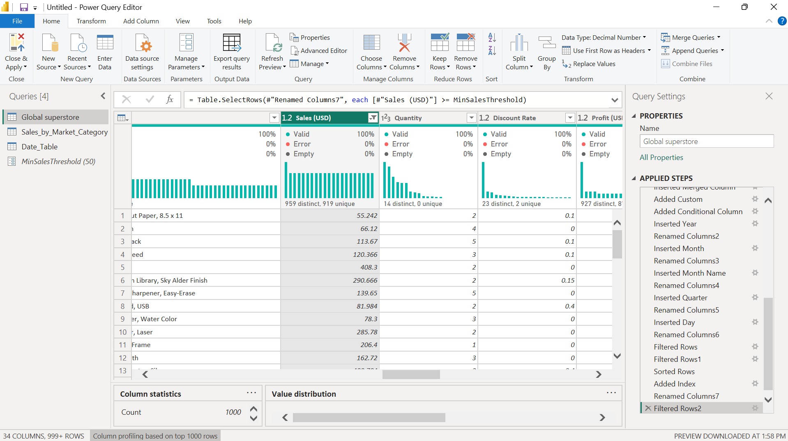

A parameter named **"MinSalesThreshold"** was created with the following properties:

- Type: Decimal Number
- Default Value: 50
- Current Value: 50

The parameter was then used to filter the main query so only rows where Sales (USD) ≥ MinSalesThreshold are included. This allows dynamic threshold adjustment without re-editing the query.

**How it was done:** Home → Manage Parameters → New Parameter → configured as above → applied as a filter on the Sales (USD) column.

#### Advanced Task 4 — Use Column Profiling to Identify Data Quality Issues

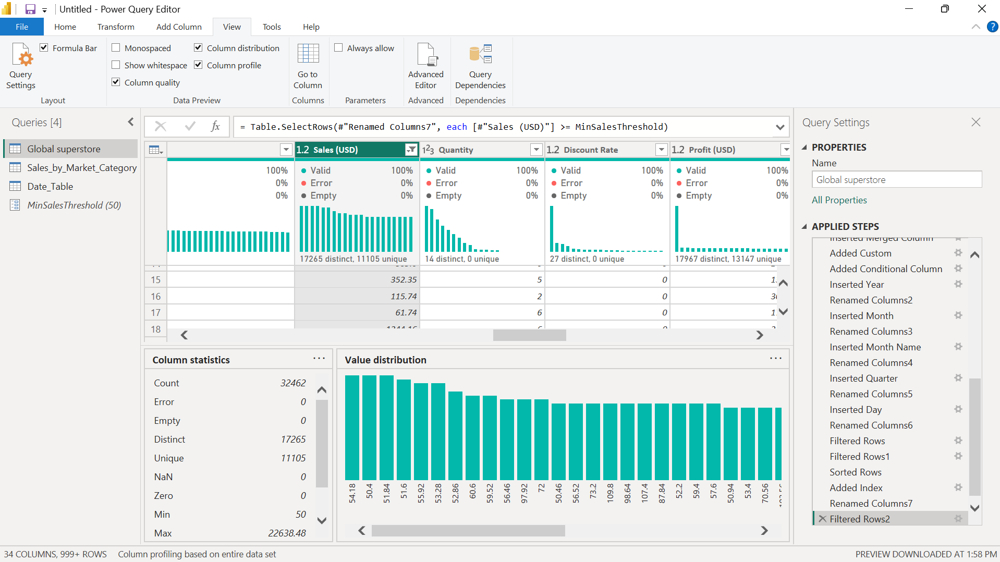

Column Profiling was enabled via View → Column Distribution, Column Quality, and Column Profile. Key findings:


| Column        | Finding                                                        |
| ------------- | -------------------------------------------------------------- |
| Postal Code   | 80.5% null — column removed                                   |
| Profit (USD)  | Contains negative values — valid (loss transactions retained) |
| Discount Rate | Range 0.0 to 0.85 — no errors found                           |
| Sales (USD)   | Right-skewed distribution (mean$246, max $22,638)              |
| Order Date    | 644 distinct values, 399 unique — valid date range            |

#### Advanced Task 5 — Extract Text Before a Delimiter

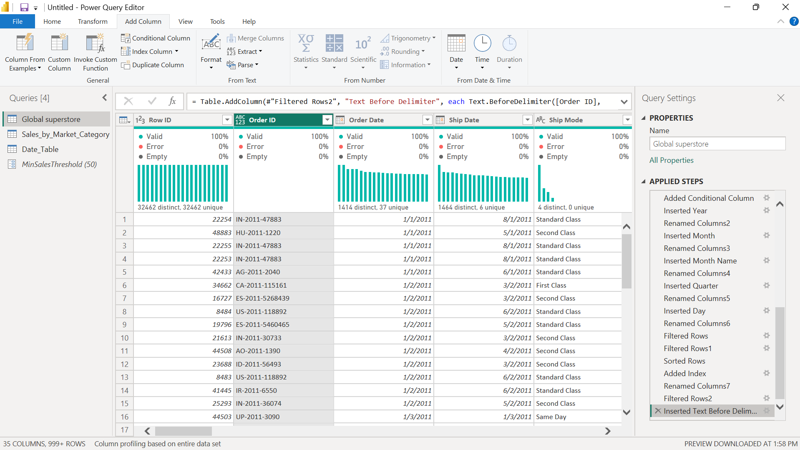

A new column **"Order Region Code"** was created by extracting text before the first "-" delimiter in the **Order ID** column.

Example: "CA-2011-100006" → "CA"

This exposes the geographic region code embedded in each Order ID, useful for regional grouping and analysis.

**How it was done:** Selected Order ID column → Add Column → Extract → Text Before Delimiter → entered "-".

### Power Query Evidence Summary


| Screenshot                  | What It Shows                                                 |
| --------------------------- | ------------------------------------------------------------- |
| `raw_datase.png`            | Dataset as imported — all 24 original columns, unmodified    |
| `power_query_editor.png`    | Full Power Query Editor view                                  |
| `Power_Query_editor...png`  | Power Query Editor with Applied Steps visible                 |
| `applied_steps.png`         | Applied Steps pane showing all transformation steps           |
| `column_profile.png`        | Column profiling results (distribution, quality, statistics)  |
| `final_cleaned_dataset.png` | Final cleaned dataset preview (23 columns)                    |
| `groupby_task.png`          | Advanced Task 1 — Group By result (Sales_by_Market_Category) |
| `date_table.png`            | Advanced Task 2 — Date Table query                           |
| `parameter.png`             | Advanced Task 3 — MinSalesThreshold parameter                |
| `extract_delimiter.png`     | Advanced Task 5 — Order Region Code extraction               |

## Question 2: Power BI Dashboard Development

The dashboard was built across **2 report pages** in Power BI Desktop.

### Page 1 — Sales Overview


**Key observations from Page 1:**

- APAC leads all markets with $3.5M in sales, followed by EU ($2.9M)
- Technology is the top revenue category ($4.7M), followed by Furniture ($4.1M) and Office Supplies ($3.4M)
- Sales show consistent year-on-year growth: $2.2M (2011) → $2.6M (2012) → $3.3M (2013) → $4.1M (2014)

### Page 2 — Detailed Analysis


| #  | Visual Type         | Title                          | Fields Used                                          |
| -- | ------------------- | ------------------------------ | ---------------------------------------------------- |
| 10 | Donut Chart         | By Customer Segment            | Customer Segment vs Count of Order ID                |
| 11 | Table Visual        | Product Name Table             | Product Name, Sales, Profit                          |
| 12 | Map Visual          | Sales by Country and Region    | Country, Region, Sales (USD)                         |
| 13 | Matrix Visual       | Market × Category Sales       | Rows: Market, Columns: Category, Values: Sales (USD) |
| 14 | Additional Visual 1 | Profit by Sub-Category         | Sub-Category vs Profit (USD)                         |
| 15 | Additional Visual 2 | Orders by Ship Mode & Priority | Ship Mode, Order Priority, Count of Orders           |

**Key observations from Page 2:**

- Consumer segment dominates with 51.65% of all orders (16,770 orders), followed by Corporate (30.22%) and Home Office (18.13%)
- APAC leads the Matrix with $1.34M in Furniture alone; United States shows strong Office Supplies performance at $646K
- Copiers ($0.26M) and Phones ($0.22M) are the most profitable sub-categories; Bookcases show the lowest profit margin
- Standard Class is the most used ship mode across all order priorities

## Question 3: Dashboard Interactivity and Insights

### Slicers Added

Three slicers were placed on Page 1 of the dashboard:


| Slicer   | Field      | Purpose                                                                        |
| -------- | ---------- | ------------------------------------------------------------------------------ |
| Slicer 1 | Order Year | Filter all visuals by year (2011, 2012, 2013, 2014)                            |
| Slicer 2 | Category   | Filter by product category (Furniture, Office Supplies, Technology)            |
| Slicer 3 | Market     | Filter by market region (Africa, APAC, Canada, EMEA, EU, LATAM, United States) |

### Drill-Down

Drill-down was enabled on the **Line Chart — Sales Trend** visual. The Order Date hierarchy allows navigation through:

**Year → Quarter → Month → Day**

The drill-down arrow (↓) was activated in the visual header. Clicking any data point on the line chart drills into that period's sub-level detail.

### Cross-Filtering

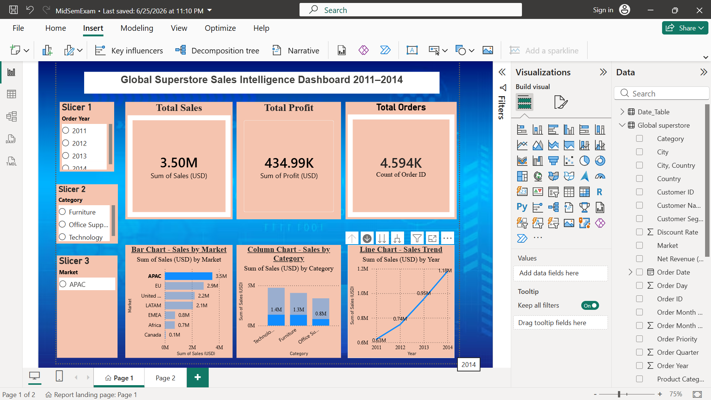

Cross-filtering is active across all visuals on both pages. Selecting a value in any visual (e.g., clicking "Technology" in the Column Chart) automatically filters all other visuals on the same page to show only Technology data. This was tested and confirmed as shown in the screenshot.

## Three Business Insights

### Insight 1 — APAC is the Highest Revenue Market but the United States Leads in Order Volume

The Bar Chart reveals that APAC generates the highest total sales at $3.5M, ahead of EU ($2.9M) and United States ($2.2M). However, when the Market slicer is set to United States and the Matrix visual is examined, the US leads in the number of individual orders — particularly in Office Supplies. This suggests that the US has a high-frequency, lower-value transaction pattern, while APAC generates fewer but higher-value orders. Management should consider a premium upsell strategy in APAC and a volume-efficiency strategy in the US to optimize both markets.

### Insight 2 — Consumer Segment Dominates Orders but Corporate Clients Drive Higher Per-Order Value

The Donut Chart shows that the Consumer segment accounts for 51.65% of all orders (16,770 orders), while Corporate holds 30.22% (9,810 orders) and Home Office 18.13% (5,890 orders). However, when filtering by Corporate in the Category slicer and reviewing the Table Visual, Corporate orders tend to involve higher-value Technology products. This means Corporate customers, despite fewer orders, contribute disproportionately to revenue per transaction. A targeted account management programme for Corporate clients could yield significant profit growth without requiring large volumes.

### Insight 3 — Sales Are Growing Year-on-Year but Profitability Growth is Lagging

The Line Chart shows clear, consistent revenue growth from $2.2M in 2011 to $4.1M in 2014 — an 86% increase over 4 years. However, comparing Total Sales ($12.19M) against Total Profit ($1.45M) on the KPI cards reveals an overall profit margin of only approximately 11.9%. The Profit by Sub-Category visual (Additional Visual 1) shows that several sub-categories like Bookcases and Storage record very low or negative profit margins. This indicates that while the business is growing in sales volume, cost management — particularly around discounting and shipping costs — needs urgent attention to ensure that revenue growth translates into proportional profit growth.
